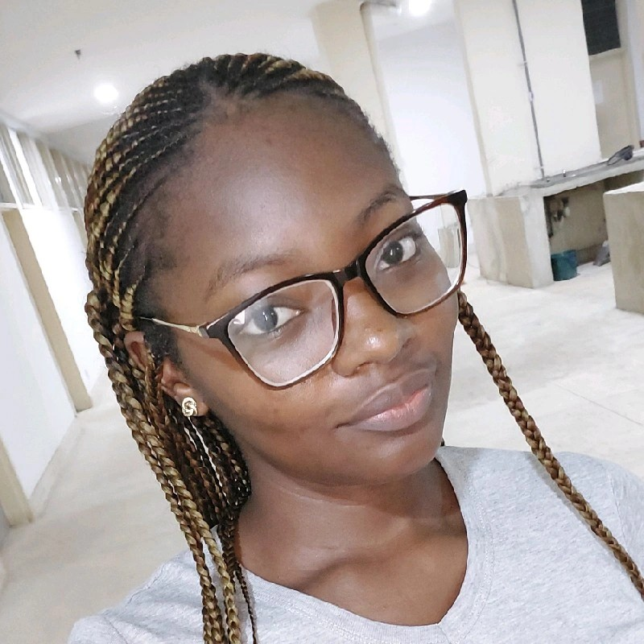

# 👨‍💻 Web and Mobile Developer

Hi! I’m an experienced **Full-stack Mobile Developer** who has both worked in teams and led teams to building fast, scalable, and user-friendly crossplatform mobile applications in React Native.

## 🧰 Tech Stack

- **React Native**
- **Reactjs**
- **Node.js** 
- **Python Django**  
- **FastAPI** 
- **Flask**
- **Native Android (Kotlin and JetpackCompose)**

---

## 🖼️ About Me

I'm focused on delivering practical, maintainable software solutions that solve real-world problems. Whether you're building a mobile app from scratch or scaling an API to handle thousands of users, I can help make it happen.

---

## 💼 Projects

### 1. **Toota - Logistics Mobile App**
Cross-platform ReactNative app that connects users with licensed truck drivers for waybills for heavy goods. 
**Tech:** ReactNative  
👉 In Progress

### 2. **Whispers – Manage Distractions - Android Native**  
Android Native App that helps users manage distractions and save ideas.
**Tech:** Kotlin, JetpackCompose, FastAPI (for the backend)  
👉 [View on Github](https://github.com/ellalearns/whispers)

### 3. **RoleDrop – Real-time Job Bot for Remote Workers**  
A Telegram bot that scrapes multiple job boards and sends curated job alerts to users.  
**Tech:** Python, FastAPI, SQLite, Telegram API  
👉 [Live App]()

---

## 🎓 Education

- **ALX Holberton School**  
  *Software Engineering* – Graduated 2023

- **University of Nigeria, Nsukka**  
  *Medical Laboratory Science* – Completed 2023

---

## 📫 Contact

- **Email:** ella.appdev@gmail.com  
- **GitHub:** [github.com/ellalearns](https://github.com/ellalearns)  
- **LinkedIn:** [linkedin.com/in/ella-agu-dev](https://linkedin.com/in/ella-agu-dev)

---

Thanks for stopping by! 👋
